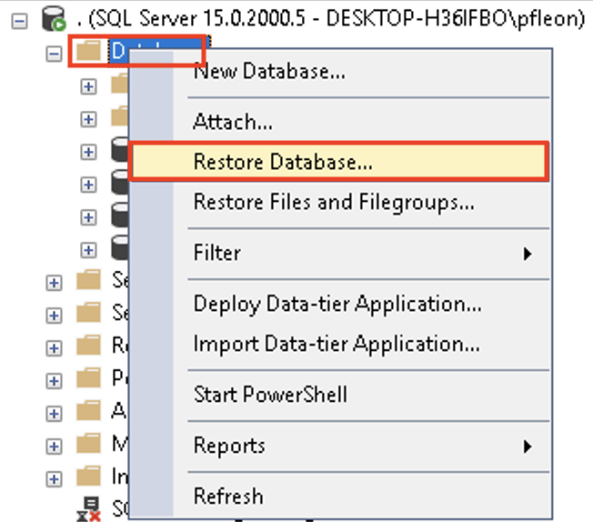
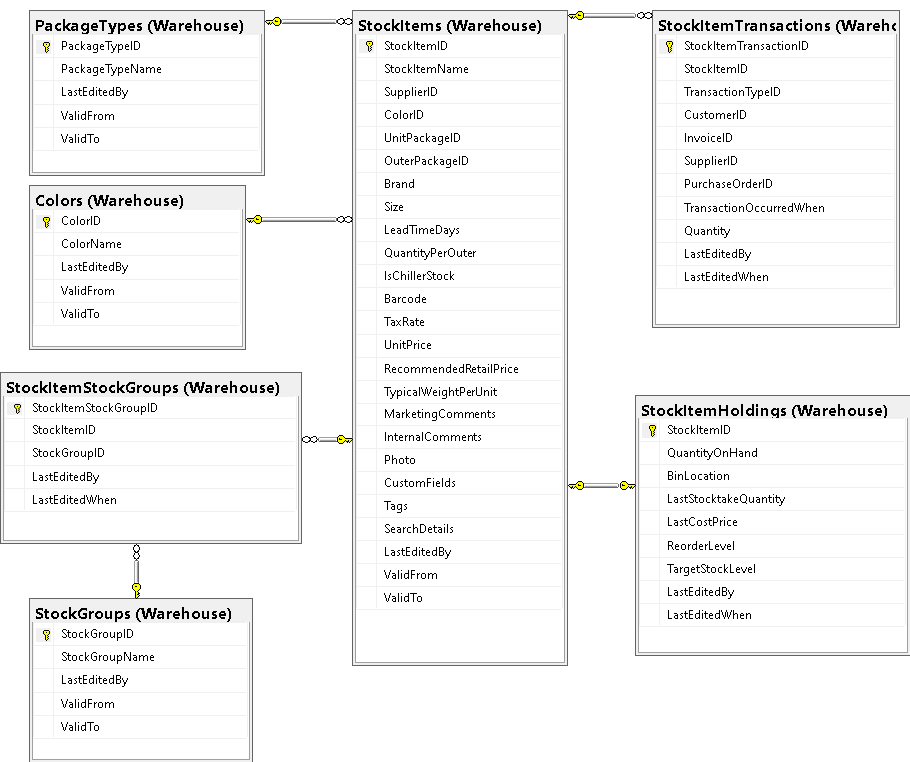

# Module 03 - Langage de manipulation de données

Dans ce module, vous allez devoir dessiner les étapes d'exécutions de requêtes sur des exemples simples afin de valider votre compréhension de l'ordre des exécutions des différentes parties de l'instruction ```SELECT```.

Vous allez ensuite devoir installer la base de données "Wide World Importers" provenant des bases de données exemple de Microsoft.

La base de données "Wide World Importers" est décrite dans la documentation :

- [Informations générales](https://learn.microsoft.com/en-us/sql/samples/wide-world-importers-what-is)
- [Description des schémas et des tables](https://learn.microsoft.com/en-us/sql/samples/wide-world-importers-oltp-database-catalog)
- [Génération de données jusqu'à la date courante](https://learn.microsoft.com/en-us/sql/samples/wide-world-importers-generate-data)

## Préalable 1 - Restoration de la base de données "Wide World Importers"

### Préalable 1.1 - Téléchargement de la base de données

- Téléchargez le [fichier zip ici](https://1drv.ms/u/s!AmZSjqmP5Ux1kaQW7lYjSAsH89pDmw?e=XTOVOG)
- Désarchivez le fichier dans le répertoire ```C:\Program Files\Microsoft SQL Server\MSSQL15.MSSQLSERVER\MSSQL\Backup```

### Préalable 1.2 - Restoration de la base de données

- Lancez SSMS et connectez-vous à votre SGBD
- À partir de l'explorateur d'objets, faites un clic droit sur l'option "Databases" et choisissez "Restore Database..."

- Dans la nouvelle fenêtre, sélectionnez l'option "Device" et spécifiez le chemin de votre fichier à restaurer grâce à l'option "..."
- La base de données ainsi que le plan de restauration vont s'afficher en dessus du chemin du fichier : cliquez simplement sur le bouton "OK"

- SSMS devrait vous indiquer que la restauration a été effectuée avec succès

## Exercice 1 - On expérimente le papier

Soit les tables "etudiant", "cours" et "etudiant_cours" :

| **etudiantId** | **prenom** | **nom**   |
|----------------|------------|-----------|
| 1              | Marie      | Vière     |
| 2              | Alex       | Terrieur  |
| 3              | Alain      | Terrieur  |
| 4              | Gille      | Éparballe |
| 5              | Alain      | Verse     |

| **coursId** | **titre**                             |
|-------------|---------------------------------------|
| 1           | Philosophie                           |
| 2           | Introduction à la productivité        |
| 3           | Viennoiserie - Spécialité Chocolatine |

| **etudiantId** | **coursId** | **dateDebut** | **dateFin** | **noteFinale** |
|----------------|-------------|---------------|-------------|----------------|
| 1              | 3           | 2022-08-29    | NULL        | NULL           |
| 2              | 3           | 2022-08-29    | NULL        | NULL           |
| 3              | 3           | 2022-08-29    | NULL        | NULL           |
| 4              | 3           | 2022-01-03    | 2022-06-06  | 54             |
| 5              | 3           | 2022-01-03    | NULL        | NULL           |
| 5              | 3           | 2022-08-29    | NULL        | NULL           |
| 1              | 1           | 2022-01-03    | 2022-06-06  | 81             |
| 2              | 1           | 2022-01-03    | 2022-06-06  | 50             |
| 3              | 1           | 2022-01-03    | 2022-06-06  | 75             |
| 4              | 1           | 2022-01-03    | 2022-06-06  | 45             |
| 5              | 1           | 2022-01-03    | NULL        | NULL           |

- Sur papier, écrivez les requêtes suivantes et illustrez-les comme dans le cours :

  - Affichez le titre de tous les cours qui contiennent la lettre 'c' dans le titre
  - Affichez les étudiants qui suivent au moins deux cours avec le nombre de cours suivi (dateFin IS NULL)
  - Affichez le nombre de cours réussis pour chaque étudiant
  - Affichez la liste des cours suivis par au moins un étudiant pour la session qui a débuté le '2022-08-29'

- Ouvrez SSMS et implantez les tables et les données dans la base de données 'M03_Exercice1'
- Testez vos requêtes précédentes

## Exercice 2 - Wide World Importers - Warehouse

Voici une extraction des tables contenues dans le schéma "Warehouse" avec lequel vous allez travailler. Pour plus de détails, vous pouvez [vous référer à la référence ici](../BDs/README.md).



- Analysez les champs de la table "Warehouse.StockItems"
- Écrivez les requêtes suivantes à partir du schéma "Warehouse" :
  - Affichez l'ensemble des produits donc la quantité disponible est supérieure à 500000
  - Affichez l'ensemble des produits qui ont au moins deux groupes
  - Affichez l'ensemble des produits qui n'ont pas de groupe

## Exercice 3 - Wide World Importers - Sales

- Connectez-vous à votre SGBD avec SSMS
- À partir de l'option "Database Diagrams" de la base de données "Wide World Importers", créez un diagramme qui contient la table "Invoices" et "Orders" et ses dépendances directes du schéma "Sales".
- Écrivez les requêtes suivantes :
  1. Affichez les commandes non facturées
  2. Comptez le nombre de commandes non facturées
  3. Prenez l'identifiant d'une de ces commandes et affichez le détail de la commande avec le total avant taxes et après taxes
  4. Affichez le chiffre d'affaire non facturé
  5. Affichez le chiffre d'affaire non facturé par année
  6. Affichez le chiffre d'affaire non facturé par année et par mois
  7. Affichez les commandes de plus de 3 articles qui ne sont pas facturées
  8. Affichez la facture 4242 avec son détail (+ montant sans et avec taxes)
  9. À partir de votre précédente requête, trouvez une manière d'insérer le résultat dans la nouvelle table "Facture_4242"
  10. Créez une nouvelle table dans le schéma "Sales" qui s'appelle "InvoicesCache" qui permettra d'ajouter de l'information aux factures sans toucher aux tables d'origines. Elle doit contenir, en plus des informations de liaisons :
      1. Le montant total des taxes
      2. Le montant de la facture avant et après taxes
   11. Écrivez une requête d'insertion qui rempli la nouvelle table
   12. Ajoutez une clause à votre requête qui vous évite les erreurs d'insertion à la deuxième exécution de la requête.