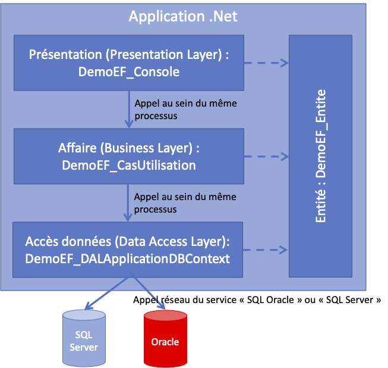

# Démo ORM avec .Net, Entity Framework Core, Oracle

## DAL (Data Access Layer)

Les classes DTOs utilisent des attributs afin de définir les noms des colonnes qui sont sensibles à la casse.

## Anti-pattern

L'utilisation des dépôts de données est ici un anti-pattern car Entity Framework Core est fait pour suivre les modifications. Or, dans notre modèle, on protège chaque couche des différentes technologie. 

Si nous ne faisons pas cela, la couche affaire va être polluée par les attributs de la couches de données. De plus, cela obligerait à définir les entités d'affaires comme étant les même que les entités de données. Cela n'est pas une bonne idée, car les classes d'affaires n'ont pas forcément les mêmes attributs que les classes de données qui ne servent "qu'à la persistance".

## Design de l'application

## Diagramme de dépendances de l'exemple

Version simplifiée : 

Version plus détaillée : 
